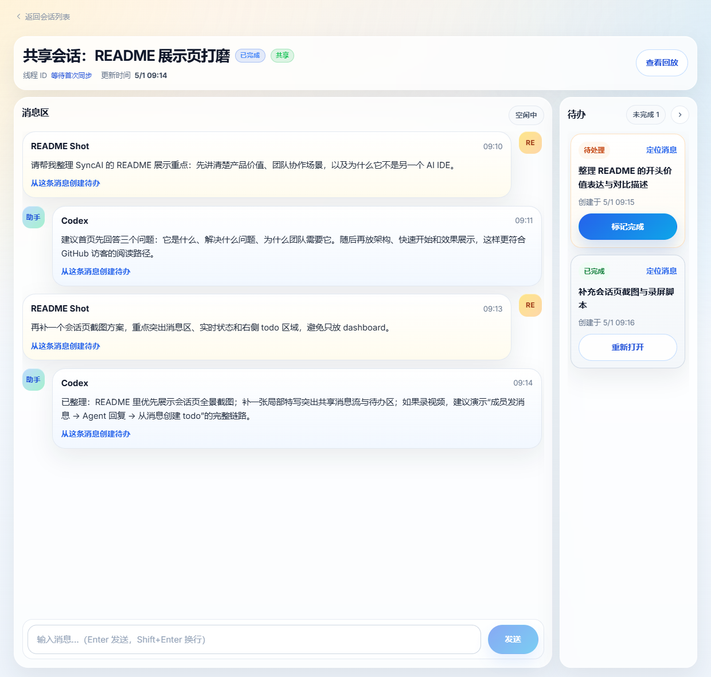
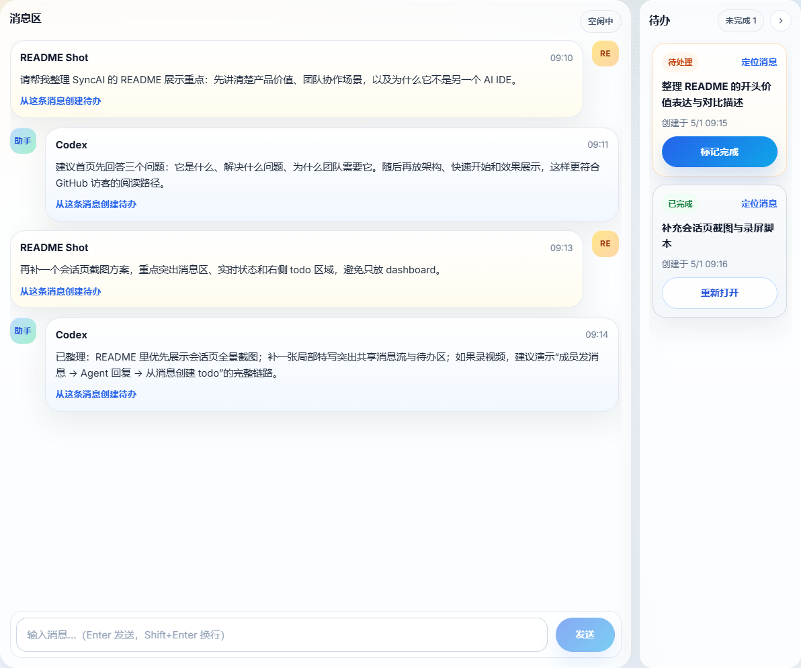

# SyncAI / 灵悉 AI

> 把原本只存在于个人终端里的 AI 编程过程，变成团队可共享、可协作、可沉淀的项目资产。

> SyncAI is a collaborative AI coding workspace for small teams. It turns local, personal AI sessions into shared project assets with real-time visibility, searchable history, replayable execution context, and lightweight collaboration around the same agent workflow.


SyncAI 是一个面向小团队的 AI 编程协作与共享平台。它不试图重做 Codex 或 Claude Code，而是在现有 Agent 能力之上，补上团队协作层：共享会话、实时可见、过程沉淀、搜索回放，以及围绕会话上下文的轻量协作。

如果你的团队已经在使用 Codex，但会话还停留在“每个人的本地终端里”，SyncAI 的目标就是把这些过程收拢到一个能持续协作的工作空间中。

## 为什么要做这个项目

很多团队开始使用 AI 编程后，很快会遇到同一类问题：

- AI 会话历史只保存在个人电脑里，团队无法复用上下文
- 同一个任务被多人重复提问、重复试错、重复踩坑
- 其他成员看不到 Agent 当前做到哪一步，也难以接着推进
- 讨论、执行结果、行动项散落在终端、聊天工具和手工 todo 里，难以沉淀成项目资产

SyncAI 关注的不是“个人如何更快地使用 AI”，而是：

- 团队如何围绕同一个 Agent 会话持续协作
- 团队如何把 AI 执行过程沉淀为可搜索、可回放、可追踪的协作记录
- 团队如何在不引入复杂流程系统的前提下，获得足够清晰的上下文共享与协作可见性

## 产品优势

### 1. 共享会话，而不是复制上下文
- 团队成员围绕同一个底层 Agent 会话协作，而不是各自保留一个本地副本
- 新成员可以直接接手已有会话，不需要从零重建上下文
- 支持共享会话与私有会话，兼顾协作与必要的隔离

### 2. 实时可见，减少“黑盒感”
- 基于 WebSocket 实时同步消息、状态和排队信息
- 前端明确展示运行中、排队中、完成、失败等状态
- 可以看到会话正在处理什么，降低多人协作时的信息不对称

### 3. 过程可沉淀，不止拿结果
- 搜索覆盖成员消息与 Agent 最终回复，方便后续复盘和复用
- 回放覆盖消息、状态变化与命令过程摘要，让协作历史可追踪
- 共享转私有后仍保留审计信息，适合团队内的知识沉淀

### 4. 轻量协作，不强行变成任务系统
- 支持从消息中手动提取 todo，并保留来源消息
- 点击 todo 可以回到原始上下文，继续协作而不是跳出会话
- 产品边界清晰，优先把“共享会话协作”这条主链路做好

## 适合谁使用

SyncAI 目前更适合这类团队：

- 2 到 20 人的小型研发团队
- 已经在使用 Codex，或者计划把 Agent 编程能力引入团队协作流程的团队
- 希望围绕同一个任务上下文协同推进，而不是每个人单独和 AI 对话
- 希望把消息、结果、todo、搜索和回放沉淀为长期可复用的项目资产

## 效果预览

### 会话页总览



### 会话页细节



> 当前更推荐优先展示会话页，因为它最能体现 SyncAI 的核心价值：共享消息流、协作上下文，以及围绕会话的轻量 todo 跟进。

## 项目架构

SyncAI 采用 monorepo 结构，把前端、后端和共享契约放在同一个仓库中，重点保证协作链路的数据结构一致。

```text
Team Members (Browser)
        |
        v
React + Vite Web App
        |
        v
Fastify API + WebSocket Gateway
        |
        v
Workspace Runtime / Session Scheduler
        |
        v
Codex Adapter
        |
        v
Local Codex CLI Runtime

PostgreSQL  <--- persistence / messages / sessions / todos / replay
Redis       <--- queue / runtime state / coordination
packages/shared <--- shared contracts between server and web
```

### 架构分层说明

- `web/`：React + Vite 前端，负责团队、项目、会话、消息、todo、搜索与回放体验
- `server/`：Fastify 后端，负责 HTTP API、WebSocket 实时推送、会话调度和 Agent 接入
- `packages/shared/`：前后端共享类型、状态枚举和契约，避免数据结构各写一份
- `PostgreSQL`：持久化团队、项目、会话、消息、todo 和回放记录
- `Redis`：承载会话排队、运行态和协调状态
- `Codex Adapter`：把底层 Codex 执行过程映射成平台可展示、可回放的统一记录

## 核心能力

- 共享会话 / 私有会话
- 团队成员围绕同一个会话持续追加消息
- WebSocket 实时同步消息、状态与排队信息
- 会话级 todo 提取与状态更新
- 消息与最终回复搜索
- 消息、状态变化、命令摘要回放
- 团队、项目、会话三级组织结构

## 快速开始

### 前置条件

- Node.js `>= 24`
- npm
- Docker Desktop
- 可用的 Codex CLI（如果你要体验真实 Agent 执行链路）

### 1. 安装依赖

```bash
npm install
```

### 2. 配置环境变量

```bash
cp .env.example .env
```

Windows PowerShell 也可以直接手动复制 `.env.example` 为 `.env`。

### 3. 启动 PostgreSQL 和 Redis

```bash
npm run db:up
```

### 4. 执行数据库迁移

```bash
npm run db:migrate
```

### 5. 启动前后端开发环境

```bash
npm run dev
```

启动后默认访问：

- Web: `http://localhost:5173`
- Server: `http://localhost:3001`

### 6. 健康检查

```bash
npm run doctor
```

如果你还想顺便验证本机 Codex 可执行状态：

```bash
npm run doctor -- --with-codex-exec
```

## 常用命令

```bash
npm run dev              # 同时启动前后端
npm run dev:server       # 仅启动后端
npm run dev:web          # 仅启动前端
npm run db:up            # 启动 PostgreSQL / Redis
npm run db:migrate       # 执行数据库迁移
npm run build            # 构建 shared -> server -> web
npm run typecheck        # 全仓 TypeScript 校验
npm run test             # 提交前回归门禁
npm run test:unit        # 单元测试
npm run test:contracts   # 契约测试
npm run test:integration # 集成测试
npm run test:e2e         # E2E 测试
npm run test:smoke       # 冒烟测试
npm run doctor           # 环境自检
```

## 仓库结构

```text
.
├── server/                 # Fastify 后端与运行时集成
├── web/                    # React + Vite 前端
├── packages/shared/        # 前后端共享类型与契约
├── tests/                  # unit / contracts / integration / e2e / smoke
├── scripts/                # 开发、测试与环境诊断脚本
└── docs/                   # 产品、架构、测试与协作文档
```

## 文档导航

- [产品需求文档](./docs/01-产品/产品需求文档.md)
- [使用说明](./docs/01-产品/使用说明.md)
- [概要设计](./docs/02-架构设计/概要设计.md)
- [Agent 接入设计](./docs/02-架构设计/Agent接入设计.md)
- [数据库设计](./docs/02-架构设计/数据库设计.md)
- [API 设计](./docs/02-架构设计/API设计.md)
- [启动说明](./docs/05-环境与协作/启动说明.md)
- [Codex 协作约束](./docs/05-环境与协作/Codex协作约束.md)

## 当前说明

- 当前重点聚焦在小团队 AI 编程协作闭环，而不是企业级复杂权限或多 Agent 编排
- 默认围绕 Codex 接入设计，Claude Code 兼容能力作为后续扩展预留
- 项目仍在持续迭代中，接口和页面细节可能继续演进

## 开源发布前建议

如果你准备把项目正式发布到 GitHub，建议在 README 之外再补齐这几项：

- `LICENSE`：明确开源协议
- `CONTRIBUTING.md`：贡献方式、开发流程、提交流程
- `CODE_OF_CONDUCT.md`：社区协作规范
- 更完整的截图 / GIF / 演示视频：提升项目首页转化率和理解速度

## 致谢

SyncAI 站在现有 Agent 编程能力之上，目标不是替代底层工具，而是把团队协作层补完整。
